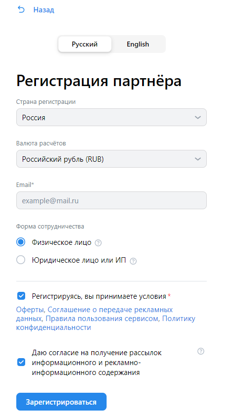
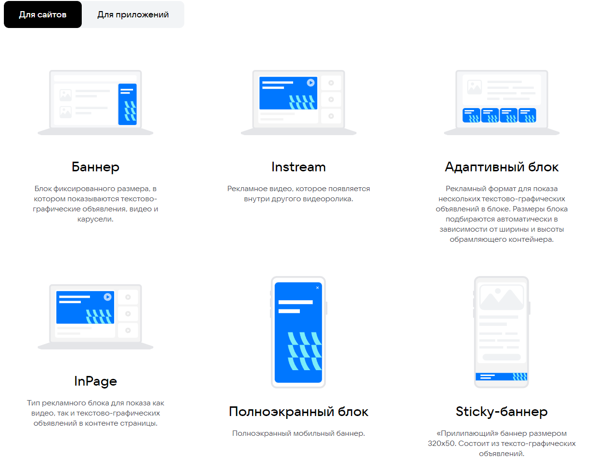
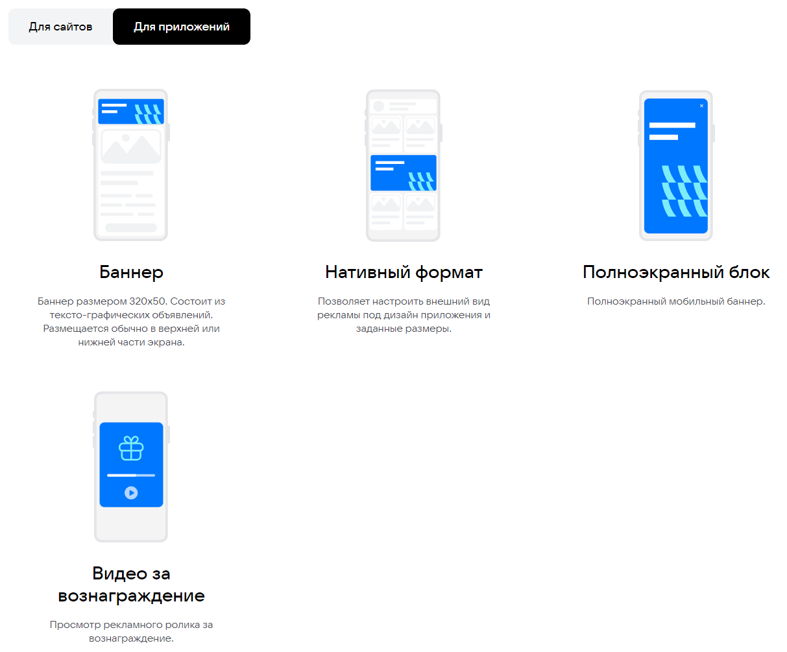
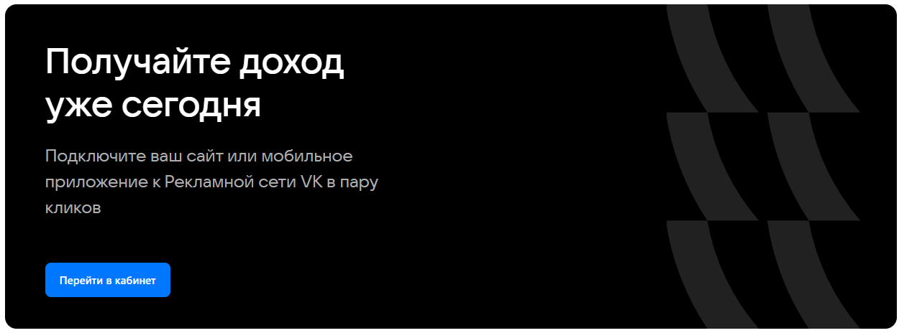
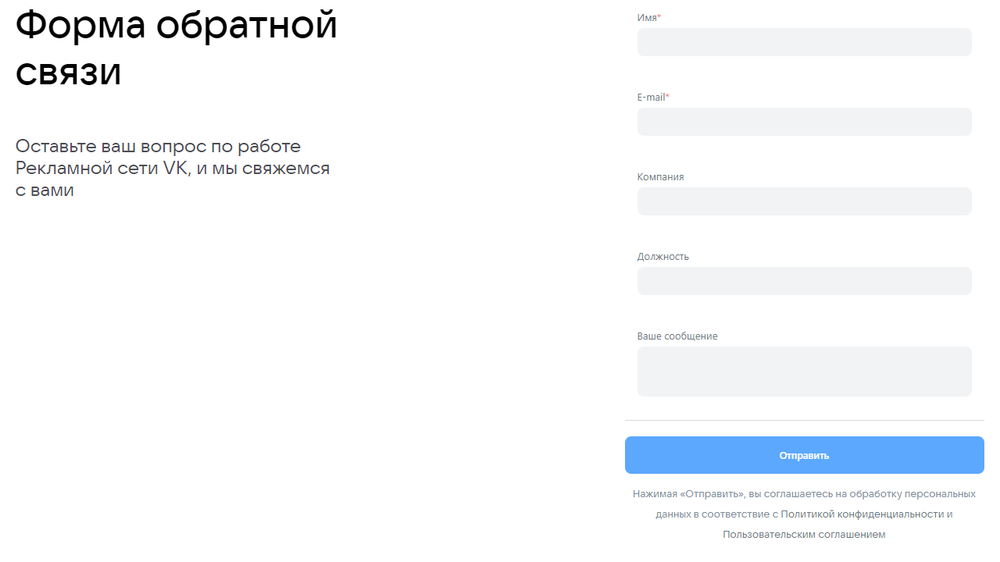
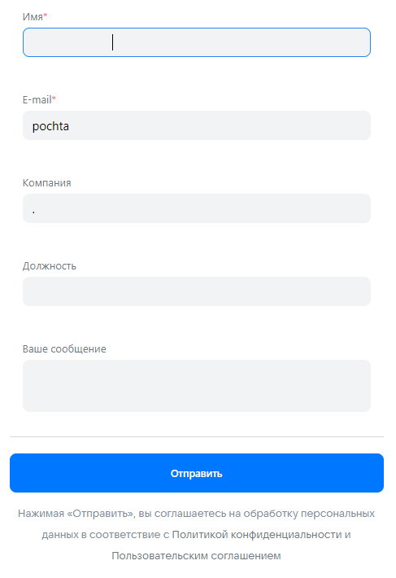
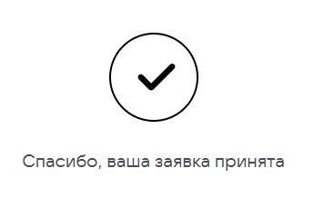
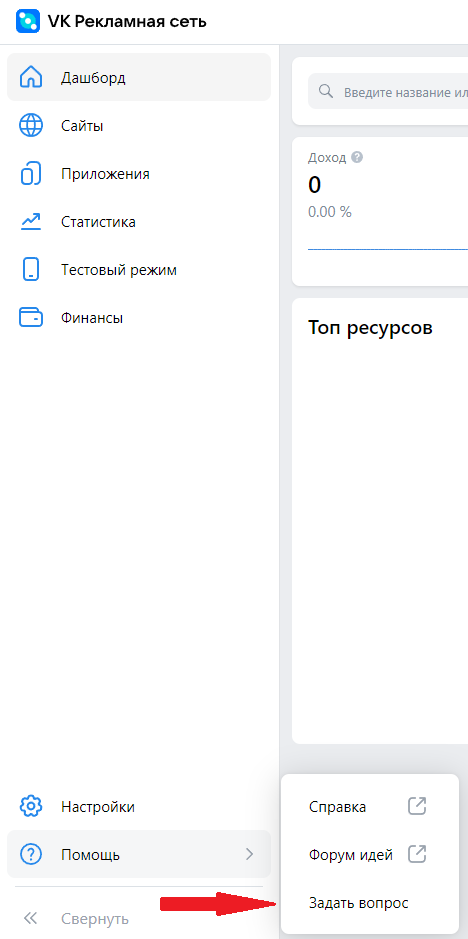
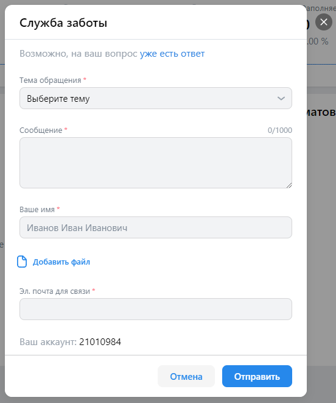
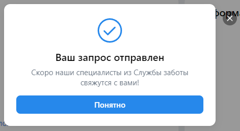

# Чек-листы для [ads.vk.com](https://ads.vk.com/)

* Регистрация партнера
* Монетизация
* Форма обратной связи
* Помощь (служба заботы)

## [Регистрация партнера](https://ads.vk.com/hq/registration/partner/new)

* `Назад`
    * При нажатии на кнопку происходит возврат на предыдущую [страницу](https://ads.vk.com/hq/registration)
* `Страна регистрации`
    * При нажатии на `окно с выбором страны регистрации` появляется выпадающее меню со списком стран мира
* `Валюта расчетов`
    * При нажатии на `окно с выбором валюты для расчетов` появляется выпадающее меню с различными вариантами
    * При выборе `страны регистрации` "Россия" предлагается только "Российский рубль (RUB)"
    * При выборе любой другой страны редлагаемыми валютами будут "Доллар США (USD)" и "Евро (EUR)"
* `Email`
    * Если кликнуть на поле и оставить его пустым, то окно ввода почты окрасится в красный цвет и появится красная подпись "Обязательное поле"
    * При попытке ввести пробелы в это поле оно окрашивается в красный и появляется подпись "Некорректный email адрес"
    * Если ввести синтаксически некорректный адрес (без знака '@', без домена, с точкой сразу перед или после '@'), то поле окрашивается в красный цвет и появляется подпись "Некорректный email адрес"
    * Во всех описанных выше случаях при нажатии на кнопку `Зарегистрироваться` ничего не произойдет, а поле `Email` останется красным с соответствующей подписью
* `Форма сотрудничества`
    * Изначально выбрано значение "Физическое лицо", можно поменять на "Юридическое лицо или ИП", оставить поле без выбора не получается
* `Пользовательское соглашение`
    * Если убрать галочку с поля `Регистрируясь, вы принимаете условия` и нажать `Зарегистрироваться`, возле этого поля появится красная подпись "Обязательное поле"
    * Поле `Даю согласие на получение рассылок информационного и рекламно-информационного содержания` не является обязательным и галочку с него можно безпрепятственно убрать

## [Монетизация](https://ads.vk.com/partner)

Верхняя часть страницы монетизации выглядит следующим образом

Из интерактивных элементов можно выделить:
* Кнопка `Перейти в кабинет`
* Кнопка `Справка`

`Перейти в кабинет`:
* При нажатии на кнопку происходит перенаправление по адресу https://id.vk.com/auth для авторизации или, если сессия уже существует, то в личный кабинет https://ads.vk.com/hq/partner

`Справка`:
* Эта кнопка направляет на https://ads.vk.com/help/categories/partner

На странице также расположен баннер следующего вида

`Для сайтов`:
* При клике на эту кнопку при уже открытой вкладке `Для сайтов` ничего не происходит, иначе происходит возврат к баннеру со скриншота выше

`Для приложений`:
* Аналогично предыдущей вкладке, при нажатии появляется следующий баннер

Внизу страницы также расположена кнопка `Перейти в кабинет`, поведение которой аналогично такой же кнопке, описанной ранее

## [Форма обратной связи](https://ads.vk.com/partner) (внизу страницы)

* Если хотя бы одно из полей "Имя" или "E-mail" не заполнено, то кнопка `Отправить` не будет активна
* При заполнении полей (в том числе и обязательных) ЛЮБЫМИ данными (пробелами и пр.), кнопка `Отправить` становится активной, валидации не происходит, форма отправляется:

## [Помощь (служба заботы)](https://ads.vk.com/hq/partner)

В личном кабинете можно открыть форму службы поддержки:

* При нажатии на кнопку `Отмена` окно закрывается
* При клике по области вне данного окна оно закрывается
* `Возможно, на ваш вопрос уже есть ответ`
    * При клике сюда происходит переход по адресу https://ads.vk.com/help/articles/partner_faq
* `Тема обращения`
    * По дефолту установлено значение "Выберите тему", если оставить значение неизменным, при нажатии на кнопку `Отправить` поле подсветится красным и появится подпись "Обязательное поле"
    * При клике на поле появляется выпадающее меню, предлагающее выбрать одну из тем обращения
* `Сообщение`
    * Максимально допустимая длина - 1000 символов. При превышении данного значения счетчик символов подсвечивается красным, а при нажатии в таком случае кнопки `Отправить` поле подсвечивается красным и появляется подпись "Убедитесь, что это значение содержит не более 1000 символов"
    * Если оставить поле пустым, то при нажатии `Отправить` оно подсвечивается красным и появляется подпись "Обязательное поле"
    * Если поле заполнить пробелами, то при нажатии `Отправить` оно подсвечивается красным и появляется подпись "Обязательное поле"
* `Ваше имя`
    * Если оставить поле пустым, то при нажатии `Отправить` оно подсвечивается красным и появляется подпись "Обязательное поле"
    * Максимально допустимая длина - 30 символов. При превышении данного значения поле подсвечивается красным и появляется подпись "Максимальная длина 30 символов"
    * Если вместо имени ввести пробелы, то оно успешно проходит валидацию
* `Добавить файл`
    * При клике открывается системное окно с предложением выбрать файл для вложения
    * Два одинаковых файла не добавляются
    * Загрузить можно документы (файлы Microsoft Office, pdf), изображения
    * При попытке загрузить видео-, аудио-, исполняемый или исходный файл или архив файл не добавляется
* `Эл. почта для связи`
    * Если оставить поле пустым, то при нажатии `Отправить` оно подсвечивается красным и появляется подпись "Обязательное поле"
    * Если ввести синтаксически некорректный адрес (без знака '@', без домена, с точкой сразу перед или после '@'), то поле окрашивается в красный цвет и появляется подпись "Некорректный email адрес"
    * Если ввести только пробелы, то поле окрашивается в красный цвет и появляется подпись "Некорректный email адрес"
    * Если адрес начинается или заканчивается пробелом, то поле окрашивается в красный цвет и появляется подпись "Некорректный email адрес"

Если все данные введены корректно, при нажатии `Отправить` появляется следующее окно:

