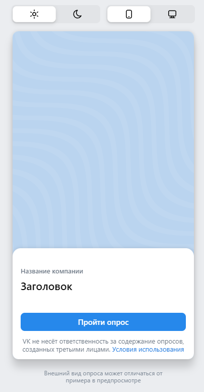

# Чек-листы для [ads.vk.com](https://ads.vk.com/)

* [Монетизация](#монетизация)
* [Форма обратной связи](#форма-обратной-связи-внизу-страницы)
* [Помощь (служба заботы)](#помощь-служба-заботы)
* [Создание опросов](#создание-опросов)

## [Монетизация](https://ads.vk.com/partner)

Верхняя часть страницы монетизации выглядит следующим образом

Из интерактивных элементов можно выделить:
* Кнопка `Перейти в кабинет` слева внизу и справа вверху
* Кнопка `Справка` справа вверху

`Перейти в кабинет`:
* Если пользователь ранее не был авторизован, то при нажатии на кнопку происходит перенаправление по адресу https://id.vk.com/auth для авторизации
* Если у пользователя уже есть сессия на сайте, то при нажатии на кнопку происходит перенаправление в личный кабинет https://ads.vk.com/hq/partner
* Обе кнопки - слева внизу и справа вверху - функционально идентичны

`Справка`:
* Эта кнопка направляет на https://ads.vk.com/help/categories/partner

На странице также расположен баннер следующего вида

`Для сайтов`:
* При клике на эту кнопку при уже открытой вкладке `Для сайтов` ничего не происходит, иначе происходит возврат к баннеру со скриншота выше

`Для приложений`:
* При нажатии на эту кнопку появляется следующий баннер:

При повторном клике на кнопку ничего не происходит

Внизу страницы также расположена кнопка `Перейти в кабинет`, при нажатии на нее происходит перенаправление по адресу https://id.vk.com/auth для авторизации. Если пользователь уже авторизован, то происходит переход в личный кабинет https://ads.vk.com/hq/partner

## [Форма обратной связи](https://ads.vk.com/partner) (внизу страницы)

* Если хотя бы одно из полей "Имя" или "E-mail" не заполнено, то кнопка `Отправить` не будет активна
* При заполнении полей (в том числе и обязательных) ЛЮБЫМИ данными (пробелами и пр.), кнопка `Отправить` становится активной, валидации не происходит, форма отправляется:

## [Помощь (служба заботы)](https://ads.vk.com/hq/partner)

В личном кабинете можно открыть форму службы поддержки:

* При нажатии на кнопку `Отмена` окно закрывается
* При клике по области вне данного окна оно закрывается
* `Возможно, на ваш вопрос уже есть ответ`
    * При клике сюда происходит переход по адресу https://ads.vk.com/help/articles/partner_faq
* `Тема обращения`
    * По дефолту установлено значение "Выберите тему", если оставить значение неизменным, при нажатии на кнопку `Отправить` поле подсветится красным и появится подпись "Обязательное поле"
    * При клике на поле появляется выпадающее меню, предлагающее выбрать одну из тем обращения
* `Сообщение`
    * Максимально допустимая длина - 1000 символов. При превышении данного значения счетчик символов подсвечивается красным, а при нажатии в таком случае кнопки `Отправить` поле подсвечивается красным и появляется подпись "Убедитесь, что это значение содержит не более 1000 символов"
    * Если оставить поле пустым, то при нажатии `Отправить` оно подсвечивается красным и появляется подпись "Обязательное поле"
    * Если поле заполнить пробелами, то при нажатии `Отправить` оно подсвечивается красным и появляется подпись "Обязательное поле"
* `Ваше имя`
    * Если оставить поле пустым, то при нажатии `Отправить` оно подсвечивается красным и появляется подпись "Обязательное поле"
    * Максимально допустимая длина - 30 символов. При превышении данного значения поле подсвечивается красным и появляется подпись "Максимальная длина 30 символов"
    * Если вместо имени ввести пробелы, то оно успешно проходит валидацию
* `Эл. почта для связи`
    * Если оставить поле пустым, то при нажатии `Отправить` оно подсвечивается красным и появляется подпись "Обязательное поле"
    * Если ввести синтаксически некорректный адрес (без знака '@', без домена, с точкой сразу перед или после '@'), то поле окрашивается в красный цвет и появляется подпись "Некорректный email адрес"
    * Если ввести только пробелы, то поле окрашивается в красный цвет и появляется подпись "Некорректный email адрес"
    * Если адрес начинается или заканчивается пробелом, то поле окрашивается в красный цвет и появляется подпись "Некорректный email адрес"

Если все данные введены корректно, при нажатии `Отправить` появляется следующее окно:

## [Создание опросов](https://ads.vk.com/hq/leadads/surveys)

Кнопка создания опроса `Создать опрос` выглядит следующим образом:

При нажатии на кнопку появляется следующее модальное окно:

### Оформление

* При нажатии на крестик возле заголовка `Новый опрос` форма закрывается, внесенные данные удаляются

* При нажатии на кнопку `Вопросы` происходит валидация форм. Если ошибок нет, то происходит переход в следующий раздел `Вопросы`

* `Название`
    * Если оставить поле пустым и нажать на кнопку `Вопросы`, то у поля появится подпись `Обязательное поле`
    * Если заполнить поле пробелами и нажать на кнопку `Вопросы`, то у поля появится подпись `Обязательное поле`
    * При вводе более чем 255 символов в форму у поля появляется подпись `Превышена максимальная длина поля`

* `Логотип`
    * При нажатии на надпись `Загрузить логотип` открывается новое модальное окно для выбора файла:  
    
        * При нажатии на окно `Загрузите медиафайлы` открывается системное окно для выбора файла
        * Изображения отображаются ниже кнопки `Загрузите медиафайлы` в разделе `Изображения`
    * К загрузке в качестве логотипа допускаются файлы формата `JPEG`, `PNG`, `GIF` весом `до 5 Mбайт` и минимальным размером `256x256px`
    * При успешной загрузке фотографии в данной форме (`Логотип`) появляются кнопки `Заменить` и `Кадрировать`  
    

* `Название компании`
    * Если оставить поле пустым и нажать кнопку `Вопросы`, то у поля появится надпись `Обязательное поле`
    * Если заполнить поле одними пробелами, то при нажатии кнопки `Вопросы` появится надпись `Обязательное поле`
    * Если ввести в форму более чем 30 символов, то появлятеся надпись `Превышена максимальная длина поля`
    * Пробелы в начале и конце введенной строки не учитываются как символы и в карточку не попадают. Можно добавить пробелы в начало или конец, валидация проходит при условии, что число остальных символов не более 30

* `Заголовок опроса`
    * Если оставить поле пустым и нажать кнопку `Вопросы`, то у поля появится надпись `Обязательное поле`
    * Если заполнить поле одними пробелами, то при нажатии кнопки `Вопросы` появится надпись `Обязательное поле`
    * Если ввести в форму более чем 50 символов, то появлятеся надпись `Превышена максимальная длина поля`
    * Пробелы в начале и конце введенной строки не учитываются как символы и в карточку не попадают. Можно добавить пробелы в начало или конец, валидация проходит при условии, что число остальных символов не более 50

* `Описание опроса`
    * Если оставить поле пустым и нажать кнопку `Вопросы`, то у поля появится надпись `Обязательное поле`
    * Если заполнить поле одними пробелами, то при нажатии кнопки `Вопросы` появится надпись `Обязательное поле`
    * Если ввести в форму более чем 350 символов, то появлятеся надпись `Превышена максимальная длина поля`

* `Окно предпросмотра` отображает внешний вид окна опроса исходя из введенных данных:  

    * При нажатии на кнопку `Светлая тема` (установлено по дефолту) превью отображается в светлых тонах
    * При нажатии на кнопку `Тёмная тема` элементы интерфейса окна предпросмотра окрашиваются в тёмные цвета
    * При нажатии на кнопку `Мобильная версия` (установлено по дефолту) отображается внешний вид превью для мобильных приложений и браузеров
    * При нажатии на кнопку `Десктопная версия` отображается внешний вид превью для десктопных приложений и браузеров

### Вопросы

Форма добавления/составления вопроса выглядит следующим образом:

  

* При нажатии на кнопку `Результат` происходит валидация форм. Если ошибок нет, то происходит переход в следующий раздел `Результат`

* При нажатии на кнопку `Назад` все изменения сохраняются и происходит возврат к предыдущему разделу `Оформление`

* `Один из списка`
    * При нажатии на кнопку появляется выпадающее меню со следующими опциями:  
    

* `Текст вопроса`
    * Если оставить форму пустой и нажать кнопку `Результат`, внизу окна создания вопроса появляется подпись `Вопрос должен быть не пустым и содержать минимум 2 ответа`
    * Если ввести в форму 68 символов, то больше символы вводиться не будут
    * Если ввести в форму только пробелы и нажать кнопку `Результат`, внизу окна создания вопроса появляется подпись `Вопрос должен быть не пустым и содержать минимум 2 ответа`
* `Введите ответ`
    * У одного вопроса может быть не менее 2-х вариантов ответа. Хотя бы 2 варианта ответа должны содержать текст. Если текст содержат менее 2-х вариантов, то при нажатии на кнопку `Результат` внизу окна создания вопроса появляется подпись `Вопрос должен быть не пустым и содержать минимум 2 ответа`
    * Если заполнить форму одними пробелами и при этом не ввести 2 других варианта ответа, содержащих текстовые символы, то при нажатии на кнопку `Результат` появится подпись `Вопрос должен быть не пустым и содержать минимум 2 ответа`
    * Если хотя бы 2 варианта ответа содержат текстовые символы, то другие варианты могут быть пустыми, при нажатии на кнопку `Результат` никакой ошибки не происходит
* `Добавить вариант`
    * Можно добавить до 5 вариантов ответа (тогда всего будет до 7 вариантов с учетом двух "по дефолту"), после чего данная кнопка пропадает
* `Ответ из шаблона`
    * При нажатии на кнопку появляется выпадающее меню со следующими опциями:  
    
    * При выборе любой опции к ответам на вопрос добавляется еще один
    * Можно выбрать только 1 шаблонизированный ответ. После выбора кнопка пропадает
    * С учетом шаблонизированного ответа может быть не более 7 вариантов ответа на вопрос
    * Если добавленный шаблонизированный ответ был 7-м по счету, то обе кнопки `Ответ из шаблона` и `Добавить вариант` пропадают
* `Дублировать`
    * При нажатии на иконку к списку вопросов в конце добавляется форма с точно таким же вопросом и вариантами ответа
    * Если достичь количества вопросов в 24, то кнопка `Дублировать` пропадает у всех форм (вопросов)
* `Добавить условие показа`
    * Кнопка появляется у формы вопроса, если общее количество вопросов больше, чем 1
    * При нажатии на кнопку появляются дополнительные формы:  
    
        * При клике по форме `Показать вопрос, если ответ на` появляется выпадающее меню с формулировками существующих вопросов
        * При клике по форме `содержит любой из` появляются варианты ответа для выбранного вопроса в виде выпадающего меню. Можно выбрать несколько вариантов
        * Если не выбрать ни одного варианта ответов в поле `содержит любой из`, то под полем появится красная подпись `Выберите хотя бы 1 вариант ответа`
        * При повторном клике на кнопку `Добавить условие показа` форма удаляется, введенные данные сбрасываются
* `Удалить вопрос`
    * При нажатии на кнопку у формы с вопросом она удаляется
    * Удалить единственный вопрос нельзя. Кнопка у него отсутствует
* `Добавить вопрос`
    * При клике на кнопку добавляется еще одна форма с вопросом
    * Максимальное число вопросов - 24, при достижении этого предела кнопка пропадает
* `Добавить стоп-экран`
    * При клике на кнопку добавляется для настройки следующая форма:  
    
    * `Завершить опрос, если ответ на`
        * При клике на форму появляется выпадающее меню с формулировками созданных вопросов
    * `содержит любой из`
        * При клике по форме появляются варианты ответа для выбранного вопроса в виде выпадающего меню. Можно выбрать несколько вариантов
        * Если не выбрать ни одного варианта ответов в поле, то под ним появится красная подпись `Выберите хотя бы 1 вариант ответа`
    * `Заголовок экрана`
        * Если оставить поле пустым, то возле него появится надпись `Обязательное поле`, а внизу всей формы `Стоп-экран` появляется надпись `Необходимо заполнить все поля`
        * Если ввести в форму только пробелы, то валидация проходит
        * Если ввести более 25 символов в форму, то валидация проходит
    * `Описание`
        * Если оставить поле пустым, то возле него появится надпись `Обязательное поле`, а внизу всей формы `Стоп-экран` появляется надпись `Необходимо заполнить все поля`
        * Если ввести в форму только пробелы, то валидация проходит
        * Если ввести более 160 символов в форму, то валидация проходит
    * `Удалить Стоп-экран`
        * При нажатии на кнопку форма закрывается, внесенные изменения удаляются

### Результат

Последний этап в создании опроса выглядит следующим образом:  
  

* При нажатии на кнопку `Назад` все изменения сохраняются и происходит возврат на этап `Вопросы`

* `Заголовок`
    * Если оставить поле пустым, то при нажатии на кнопку `Запустить опрос` возле него появляется надпись `Обязательное поле`
    * Если заполнить поле только пробелами, то при нажатии на кнопку `Запустить опрос` возле него появляется надпись `Обязательное поле`
    * Если ввести в поле более, чем 25 символов, то при нажатии на кнопку `Запустить опрос` появляется надпись `Превышена максимальная длина поля`
* `Описание`
    * Если оставить поле пустым, то при нажатии на кнопку `Запустить опрос` возле него появляется надпись `Обязательное поле`
    * Если заполнить поле только пробелами, то при нажатии на кнопку `Запустить опрос` возле него появляется надпись `Обязательное поле`
    * Если ввести в поле более, чем 160 символов, то появляется надпись `Превышена максимальная длина поля`
* `Добавить ссылку`
    * При нажатии на кнопку появляется форма для ввода с названием `Ссылка`
    * Если введенная строка начинается не с `http://` или `https://`, то появлятеся надпись `Необходимо указать протокол http(s)`
    * При добавлении после `http://` или `http(s)://` символов `@, ?, /, :, #` у поля появляется подпись `Невалидный url`
* `Запустить опрос`
    * При нажатии на кнопку формы валидируются и опрос сохраняется, после чего он отображается пользователю в общем списке опросов:  
    